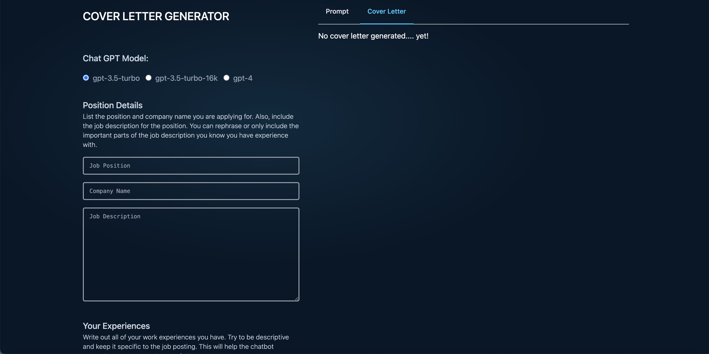

# Cover Letter Generator

## Description
An application that uses OpenAI's ChatGPT to generate cover letters for a given job post based off your custom experiences, skills, and previous cover letters.

**NOTE**: The prompt is still being updated to provide the optimally phrased text to generate the Cover Letter in the optimal way.

## OpenAI API Account Setup
This application requires setting up an API key for you OpenAI account. This is done through the URL below. When first setting up an account, at least at the time I made this app, an initial $5.00 is added for use for your first 3 months, after that, you have to fund you API account to allow for requests.

* https://platform.openai.com/account/api-keys

## Creating
This App was built using React.js and TypeScript. To setup the project, direct to the `my-app` directory and run the following commands.

```
npm install
```

## Running
To start the app, run the following commands.

```
npm start
```

**NOTE**: I might make this a single command to run.

## Application
The application uses ChatGPT to generate a cover letter based off form information. You decide the OpenAI model to use based off the complexity of the Cover Letter to be generated.

It takes in details on the position, your background experiences, and reference cover letters, then generates a prompt (can be viewed on the `Prompt` tab) to pass to the corresponding ChatGPT model. Once the response is received, the generated Cover Letter is displayed under the `Cover Letter` tab.

</img>

As of now, the prompt is auto-generated and has limited scope on additional ways of phrasing the prompt. As I hash out the best ways to phrase the prompt, I will make this more customizable.

## Additional Work
Some additional work I want to do to make this more precise and more fine-tuned for better Cover Letter generation is listed below:

1. Componetizing the Tabs
2. Factoring out the Prompt Generation to a utility module.
3. Factor our the ChatGPT Axios Call to a separate module.
4. Add additional field for Company Description.
5. Breakup the experience field into separate fields to fine tune specific jobs, projects, etc. This will make the prompt more precise when grabbing information.
6. Prompt phrasing updates.
7. Export each saved settings to a json file or something to allow for pre-loading in information from previous uses.
8. (Possibly) Not sure I like how the api key is handled in the form. I might make additional changes here, but due to me being the only one using this, I haven't put in the time to identify a better way to do this.
